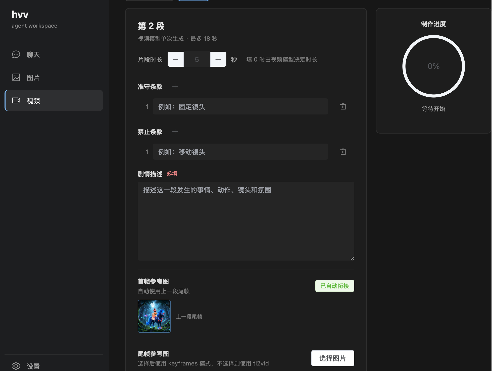

# hvv

## 这是什么

hvv 是一款专门用于 Agnes 模型的图片和视频生成工具。它把 Agnes 图片模型和视频模型
整合在一个工作台中，适合直接制作图片、连续视频片段和最终视频。

使用 hvv 前，需要准备 Agnes API Key。图片和视频请求都会通过 Agnes 服务完成，请确保
API Key 有对应的模型调用权限，并且网络可以访问 Agnes API。

## 开始使用

打开 hvv 后，左侧可以切换三个模块：

- **设置**：填写 Agnes API Key，并查看当前服务地址和模型配置。
- **图片**：使用 Agnes Image 2.1 Flash 制作图片，支持文生图和参考图生成。
- **视频**：使用 Agnes Video V2.0 制作视频片段，并按顺序衔接多个片段。

## 设置

第一次使用时，先进入左侧的“设置”模块：

1. 在 API Key 输入框中填写 Agnes API Key。
2. 点击“保存 API Key”。看到“已配置”后即可使用图片和视频功能。
3. 服务地址和聊天模型由应用配置提供，通常不需要修改。
4. 如果需要排查生成问题，可以打开“记录完整输入输出”。
   开启后会记录更多 Agent 调试信息，请注意日志中可能包含你的提示词和模型输出。

API Key 只保存在本机 hvv 配置中。不要把 API Key 填入提示词，也不要把包含 API Key 的截图
或日志公开分享。

## 图片制作

进入左侧的“图片”模块，在“描述”文本框中写清楚希望生成的画面，例如人物、环境、
动作、构图、光线和风格。

### 生成一张新图片

1. 输入图片描述。
2. 选择图片尺寸和比例。
3. 不需要参考图时，直接点击“开始制作”。
4. 图片生成后会显示在右侧图片库中，可以预览、下载或删除。

图片库按日期保存。右侧日期选择器可以查看之前生成的图片；
点击“今天”可以回到当天的图片库。

### 使用参考图

参考图不是必填项。需要保持人物、物体或画面风格时，可以使用以下任一种方式添加：

- 点击“导入图片”选择本地图片。
- 在页面中直接粘贴截图（macOS 使用 Command + V，Windows 使用 Ctrl + V）。
- 在右侧图片库中点击已有图片，将它加入参考图选择。

选中的参考图会用于本次图片生成。生成后的官方图片会自动保存到图片库，
也可以作为后续图片或视频制作的参考图。

> 注意：视频模块不能直接使用本地图片或粘贴得到的图片作为参考图。外部图片必须先
> 通过图片模块生成 Agnes 网络图，才能用于视频制作。

## 视频制作

进入左侧的“视频”模块，先新建一个视频并选择横屏或竖屏比例。视频由多个片段组成，
每个片段单独调用 Agnes 视频模型生成。

### 制作第一段视频

如果想把自己准备的人物图、产品图或其他外部图片放进视频，必须先完成以下步骤：

1. 进入“图片”模块，粘贴或导入外部图片。
2. 选中这张图片，在描述中填写“保持图片别动”或类似要求。
3. 点击“开始制作”，生成一张内容基本不变的 Agnes 网络图。
4. 回到“视频”模块，在首帧或尾帧参考图中选择这张网络图。

视频制作的参考图必须使用 Agnes 网络图，不能直接选择本地文件。

1. 在“片段时长”中设置时长，支持 0 到 18 秒。填 0 时由视频模型决定时长。
2. 在“遵守条款”中填写必须保持的内容，例如固定镜头、保持人物外貌和保持背景。
3. 在“禁止条款”中填写需要避免的内容，例如移动镜头、改变人物着装或改变背景。
4. 在“剧情描述”中填写这一段的动作、镜头、节奏、环境和声音等要求。
5. 首段视频的首帧参考图是可选的：
   - 不选择首帧时，使用文生视频方式生成，不填写 `mode`。
   - 选择首帧但不选择尾帧时，使用 `ti2vid` 模式。
   - 首帧和尾帧都选择时，使用 `keyframes` 模式，让视频从首帧过渡到尾帧。
6. 点击“制作本段视频”，等待右侧进度完成。

### 制作后续片段

1. 第一段完成后，点击“添加下一段”。
2. 后续片段会自动使用上一段视频的真实尾帧作为首帧参考图，保持人物和场景连续。
3. 填写新的遵守条款、禁止条款和剧情描述。
4. 如需明确规定结束画面，可以再选择一个尾帧参考图；否则只使用自动衔接的首帧。
5. 点击“制作本段视频”，按顺序完成后续片段。

视频生成过程中可以点击“取消生成”。生成完成后，片段会保存在当前视频 Session 中，
重新打开 hvv 后仍可继续制作。

### 预览和导出

- 打开“视频”标签可以预览已经完成的片段。
- 勾选一个片段或完整视频后，点击导出即可保存到本机。
- 选择多个片段时，hvv 会先按选择顺序合并，再导出为一个 MP4 文件。
- 完成全部片段后，可以使用最终视频作为完整成片。

## 使用建议

- 提示词尽量具体，说明主体、动作、镜头和环境，避免只写非常短的描述。
- 需要连续视频时，尽量按顺序完成片段，不要跳过上一段。
- 首帧和尾帧最好使用构图、人物和比例相近的图片，过大的差异可能造成过渡不自然。
- 视频生成受 Agnes 服务负载和 API 配额影响。服务繁忙时 hvv 会自动重试，仍失败时请稍后
  再试。
- 遇到问题时，先确认 API Key 已配置、网络正常，并查看当前 Session 的生成状态。
